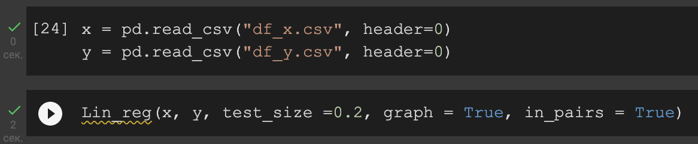
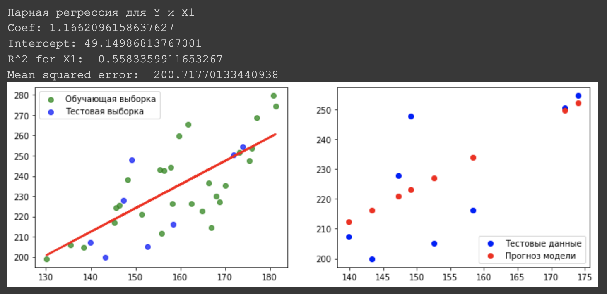
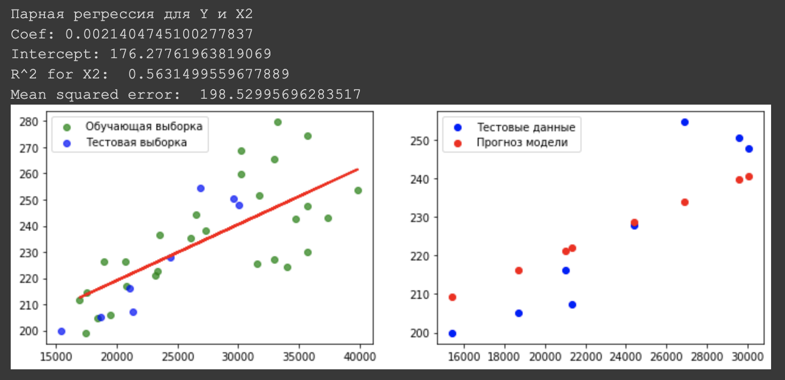
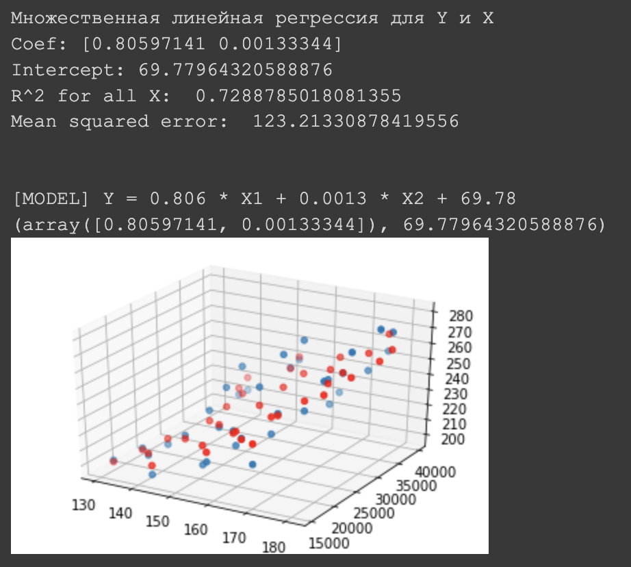
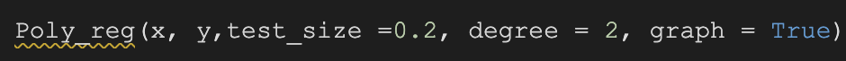
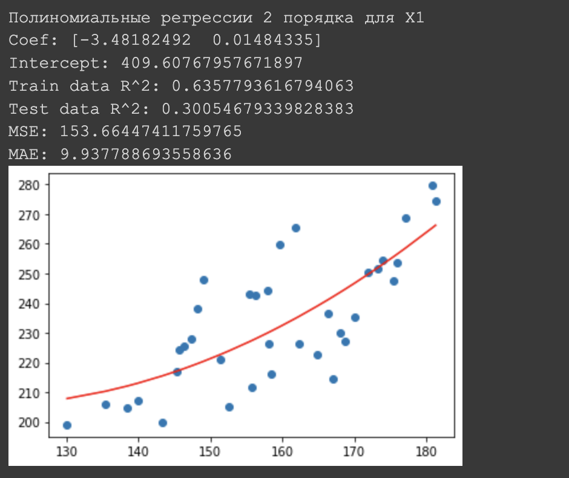
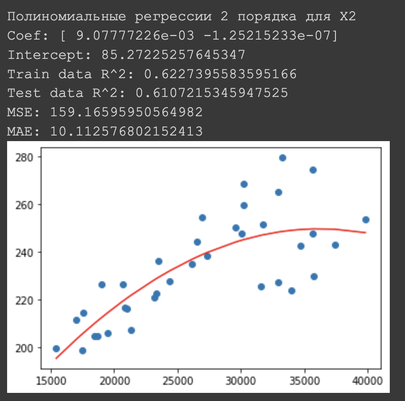

<html>
	<body>
		<h2>Оптимизационные задачи в машинном обучении.   Проект №4: Регрессия.</h2>
		

		<h3>Документация</h3>
		<h4>Всю документацию о проекте вы можете найти <a href = "documentation.pdf">здесь</a></h4>
		

		<h3>Jira</h3>
		<h4>Наша <a href = "https://opml.atlassian.net/jira/software/projects/VA4/boards/3">Аgile-доска</a> в <a href = "https://www.atlassian.com/ru/software/jira">Jira</a></h4>
		

		<h3>Решение задач</h3>
		<h4>Решить свою задачу можно в  </h4>
		

		<h3>Примеры решения задач</h3>
		<h5>Ввод параметров функции: </h5> 
		
		<h5>Вывод для регрессии y x1: </h5>                                                
		
		<h5>Вывод для регрессии y x2 : </h5> 
		
		<h5>Вывод для множественной регрессии y x : </h5> 
		
		

		<h4>Ввод параметров функции: </h4>
		
		<h5>Вывод для регрессии y x1: </h5> 
		
		<h5>Вывод для регрессии y x2: </h5> 
		
		

		<h3>Участники проекта</h3>
		<h4>
		<li>Белоцерковский Даниил - Менеджер проектa</li>
		<li>Хасыков Бата - Программист</li>
		<li>Пучков Александр - Аналитик</li>
		<li>Поплевин Роман - Аналитик, Тестировщик</li>
		<li>Бады Денис - Тестировщик</li>
		 
		Группа ПМ19-3
		</h4>
  </body>
</html>
